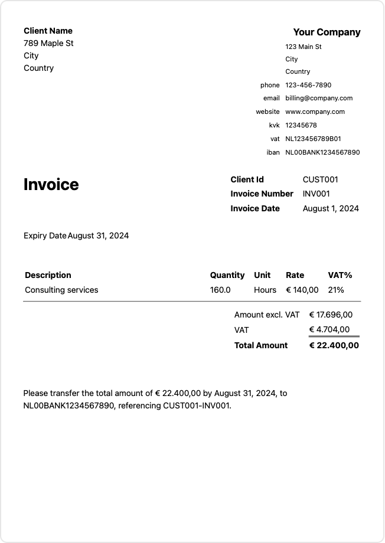
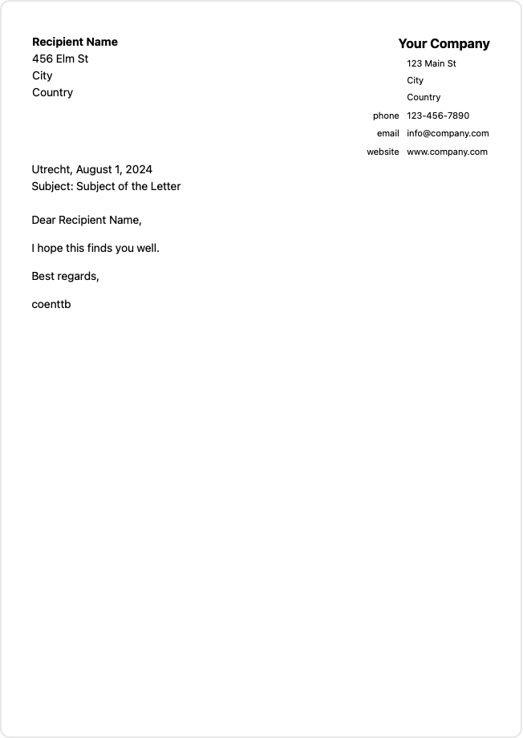

# Swift Document Templates

Swift Document Templates is a Swift package that simplifies the generation of common business documents. Designed for ease of use and automation, it leverages Swift's powerful type system and modern syntax to ensure accuracy and consistency. Whether you're generating an invoice, an agenda, or a letter, Swift Document Templates has you covered.

## Features

- **Agenda**: Create structured agendas for meetings, outlining topics, speakers, and timings.
- **Attendance List**: Maintain a record of attendees for meetings, events, or training sessions.
- **Invitation**: Send professional invitations for events, meetings, or conferences.
- **Invoice**: Generate detailed invoices with automatic calculations and custom metadata.
- **Letter**: Draft formal letters with consistent formatting and customizable content.

## Installation

To install Swift Document Templates, add the following line to your `Package.swift` file:

```swift
dependencies: [
    .package(url: "https://github.com/coenttb/swift-document-templates.git", from: "0.1.0")
]
```

You can then make Swift Document Templates available to your package's target by including DocumentTemplates in the dependencies of any target in your package, as follows:
```swift
targets: [
    .target(
        name: "TheNameOfYourTarget",
        dependencies: [
            .product(name: "DocumentTemplates", package: "swift-document-templates")
        ]
    )
]
```

Finally, import DocumentTemplates in your .swift file(s), as follows:
```swift
import DocumentTemplates

...your swift code...
```

## Usage

### Agenda

Create a meeting agenda with a list of items:

```swift
import SwiftDocumentTemplates

let agenda = Agenda(
    title: "Project Kickoff Meeting",
    date: Date(),
    variant: .short,
    items: [
        .init(title: "Introduction", important: true),
        .init(title: "Project Overview"),
        .init(title: "Q&A")
    ]
)
```

### Attendance List

Track attendance for an event:

```swift
import SwiftDocumentTemplates

let attendanceList = AttendanceList(
    title: "Weekly Team Meeting",
    date: Date(),
    attendees: [
        .init(firstName: "John", lastName: "Doe", role: "Manager", signature: "JD"),
        .init(firstName: "Jane", lastName: "Smith", role: "Developer")
    ]
)
```

### Invitation

Send a formal invitation:

```swift
import SwiftDocumentTemplates

let invitation = Invitation(
    sender: .init(name: "Your Company", address: ["123 Main St", "City", "Country"], phone: "123-456-7890", email: "info@company.com", website: "www.company.com"),
    recipient: .init(id: "INV123", name: "Jane Doe", address: ["456 Elm St", "City", "Country"]),
    invitationNumber: "001",
    invitationDate: Date(),
    eventDate: Date().addingTimeInterval(86400 * 7),
    location: "Company HQ",
    metadata: [:]
)
```

### Invoice

Generate an invoice with line items:

```swift
import SwiftDocumentTemplates

let invoice = Invoice(
    sender: .init(name: "Your Company", address: ["123 Main St", "City", "Country"], phone: "123-456-7890", email: "billing@company.com", website: "www.company.com", kvk: "12345678", btw: "NL123456789B01", iban: "NL00BANK1234567890"),
    client: .init(id: "CUST001", name: "Client Name", address: ["789 Maple St", "City", "Country"]),
    invoiceNumber: "INV001",
    invoiceDate: Date.now,
    expiryDate: (Date.now + 30.days),
    metadata: [:],
    rows: [
        .service(.init(amountOfHours: 160, hourlyRate: 140.00, vat: 21%, description: "Consulting services"))
    ]
)
```

<p align="center">
    
</p>

### Letter

Draft a formal letter:

```swift
import SwiftDocumentTemplates

let letter = Letter(
    sender: .init(name: "Your Company", address: ["123 Main St", "City", "Country"], phone: "123-456-7890", email: "info@company.com", website: "www.company.com"),
    recipient: .init(name: "Recipient Name", address: ["456 Elm St", "City", "Country"]),
    subject: "Subject of the Letter",
    body: "Dear [Recipient],\n\nThis is a placeholder letter. Please replace this text with the actual content.\n\nSincerely,\n[Your Company]"
)
```

<p align="center">
    
</p>

## Contributing

We welcome contributions to Swift Document Templates. If you find a bug or have a feature request, please open an issue on GitHub. For major changes, please open a discussion first to ensure your work aligns with the project's direction.

## License

Swift Document Templates is available under the [LICENSE](LICENSE).

## Contact

For questions or feedback, you can reach me at coen@tenthijeboonkkamp.nl.
